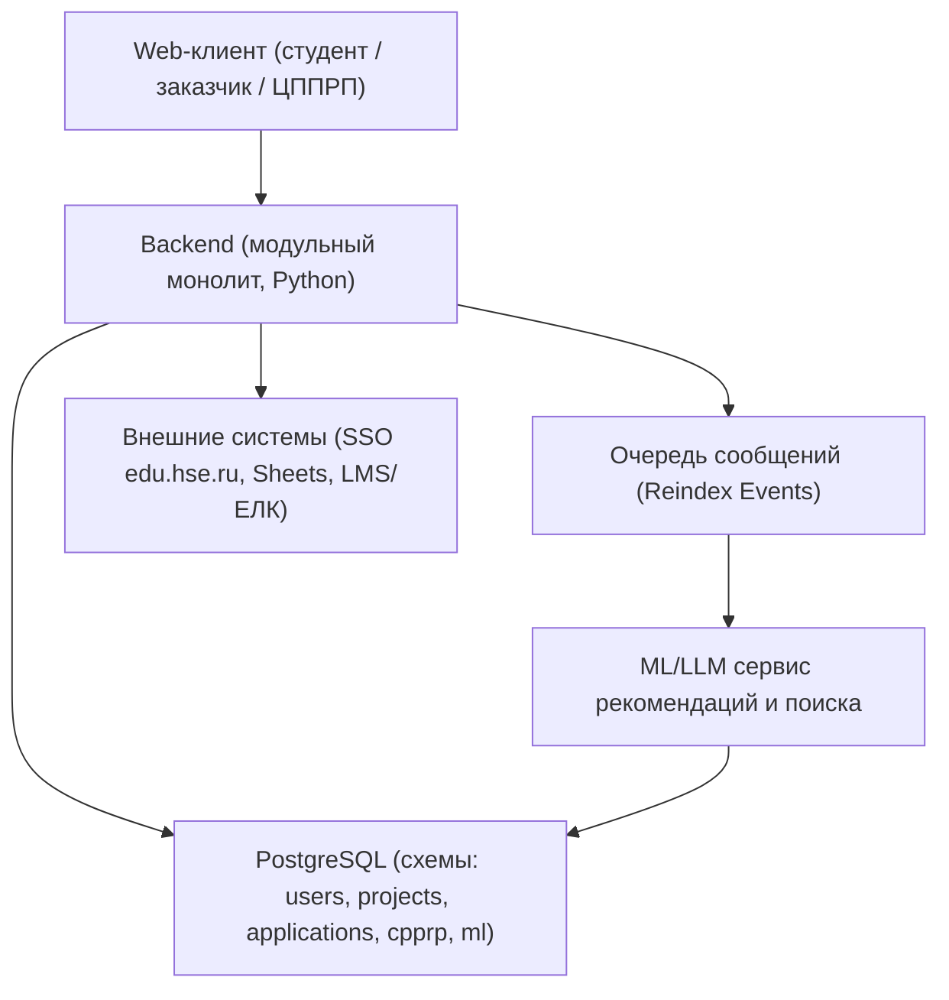
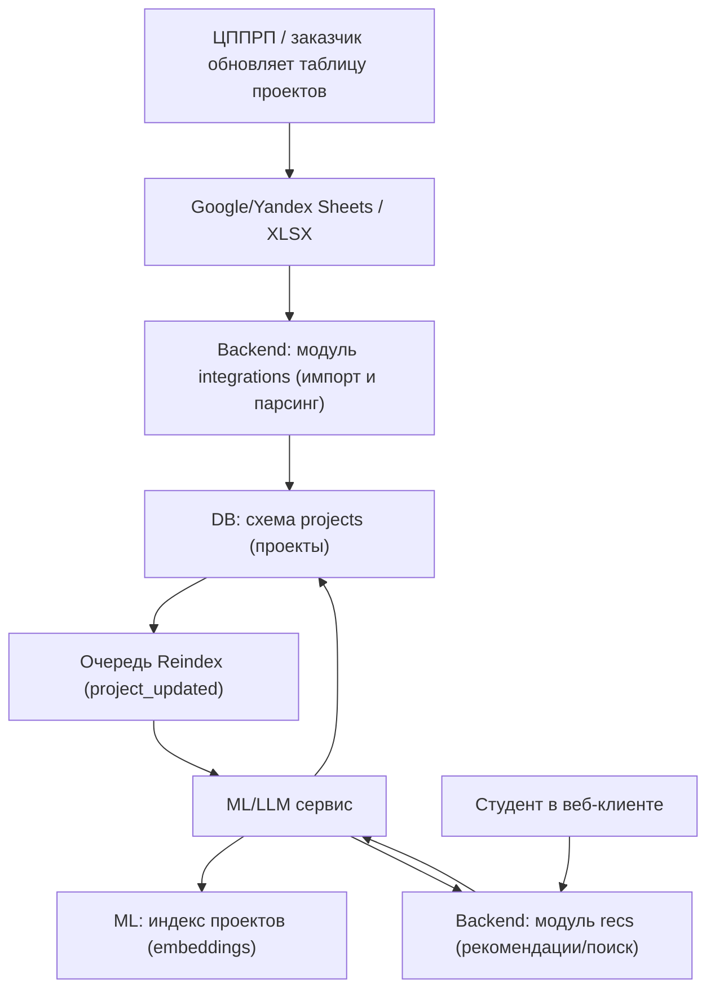

# Аrchitectural decision

Система строится как **модульный монолит на Python** (FastAPI), развернутый на серверах вуза. Внутри backend логически разделён на доменные модули: `users` (пользователи и роли), `projects` (карточки проектов, статусы, дедлайны), `applications` (заявки и их workflow), `cpprp` (настройки ЦППРП, ОП, шаблоны документов), `integrations` (SSO, Sheets, LMS/ЕЛК), `recs` (обёртка над ML-сервисом).

Данные хранятся в **PostgreSQL с подходом schema-per-module**: отдельные схемы `users`, `projects`, `applications`, `cpprp`, `ml`. Межмодульные связи реализуются через **суррогатные ключи** (ID), без join’ов между схемами на уровне приложения: модуль получает только свои таблицы, а нужные данные из других контекстов — через их API/сервисы.

Рекомендательная логика вынесена в отдельный **ML/LLM-сервис**, который работает с производными данными (embeddings, индексы). Связь между оперативными данными и ML обеспечивается через **очередь сообщений**: backend при изменении важных сущностей (проекты, интересы студентов) публикует события (`project_updated`, `student_interests_updated`), ML-сервис потребляет их, читает свежие данные из Postgres и обновляет свой индекс (FAISS/pgvector и т.п.). Это даёт **eventual consistency**, достаточную для домена, и поддерживает актуальность рекомендаций при регулярных обновлениях таблиц.

## 1) Общая архитектура

---

## 2) Потоки / обновление данных и рекомендации

