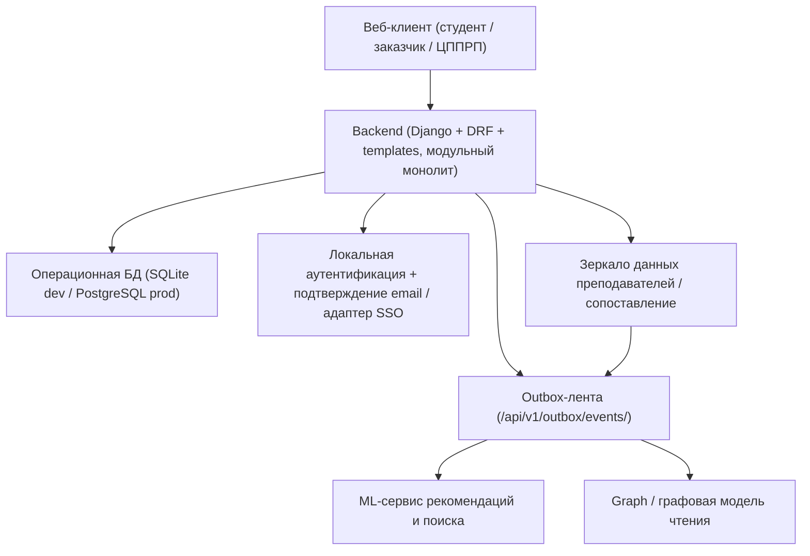
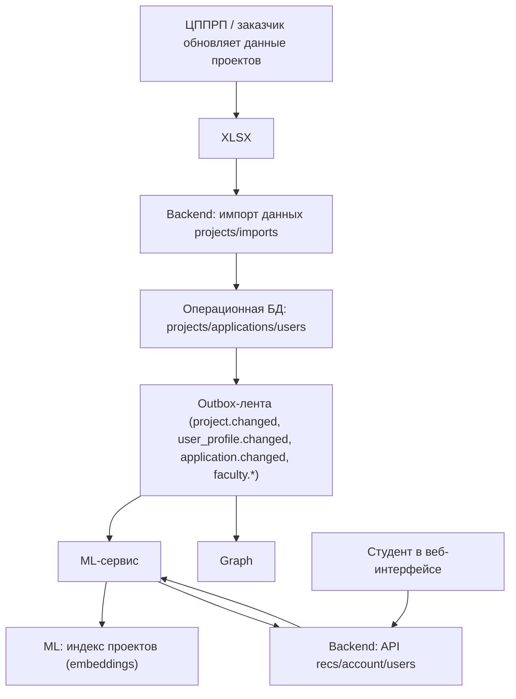

# ADR-002: Архитектурное решение

Текущая реализация построена как **модульный монолит на Python** (`src/web`, Django + DRF + Django templates), развернутый вместе с отдельными сервисами `ml` и `graph`. Внутри backend логически разделен на доменные модули: `users`, `projects`, `applications`, `account`, `imports`, `outbox`, `recs`, `faculty`, `frontend`.

Операционные данные обслуживает Django ORM: в dev/test используется SQLite, а рабочим целевым хранилищем остается PostgreSQL. Границы модулей задаются кодом и API-контрактами, а не отдельными схемами баз данных. Канонические контракты текущего контура зафиксированы в сгенерированной OpenAPI-схеме и в `docs/architecture/contracts/*`.

Рекомендательная логика вынесена в отдельный **ML-сервис**, а связи между студентами, научными руководителями, тегами и заявками строятся в отдельном сервисе **graph**. Для командной работы эти сервисы следует рассматривать как внешних потребителей по отношению к `web`; локальные `src/ml` и `src/graph` в этом репозитории выступают как эталонные реализации и интеграционные стенды. Связь между backend веб-сервиса и внешними сервисами обеспечивается через **outbox API доставки событий** (`/api/v1/outbox/events/`, `/api/v1/outbox/events/ack/`, `/api/v1/outbox/consumers/<consumer>/checkpoint/`, `/api/v1/outbox/snapshot/`): backend публикует события `project.changed`, `application.changed`, `user_profile.changed`, `deadline.changed`, `import.completed`, `recs.reindex_requested`, `faculty.*`, `project_faculty_match.changed`, а потребители читают их инкрементально, подтверждают смещение и при необходимости запускают повторное чтение. Это обеспечивает **eventual consistency**, достаточную для предметной области, и поддерживает ролевые кабинеты, рекомендации по интересам и графовое представление связей.

## 1) Общая архитектура

---

## 2) Потоки обновления данных и рекомендаций

