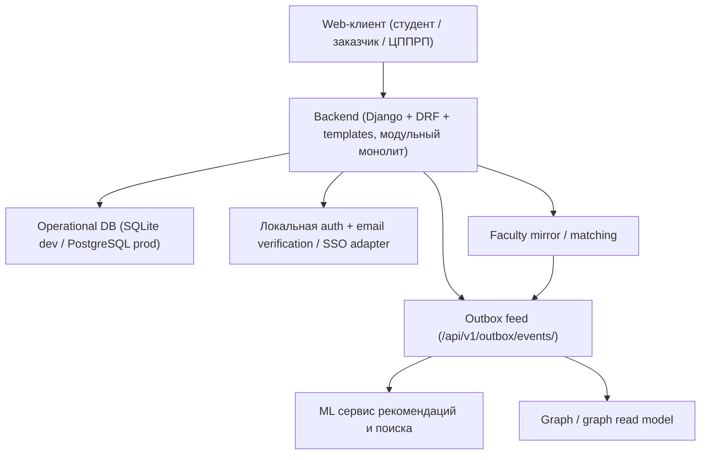
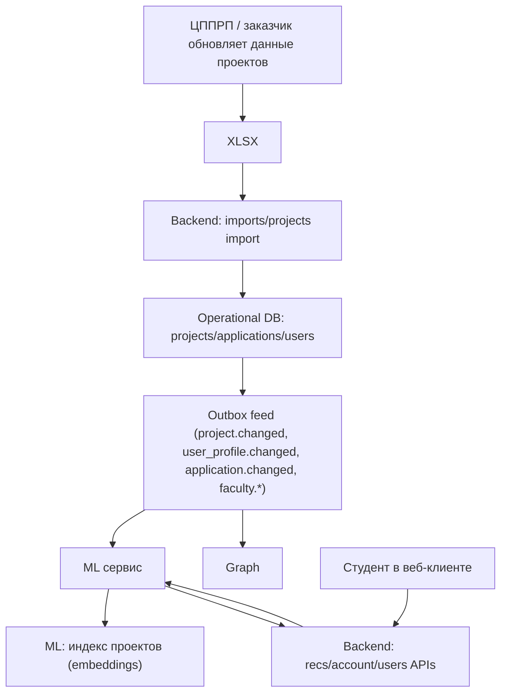

# Аrchitectural decision

Текущая реализация строится как **модульный монолит на Python** (`src/web`, Django + DRF + Django templates), развернутый вместе с отдельными `ml` и `graph` сервисами. Внутри backend логически разделён на доменные модули: `users`, `projects`, `applications`, `account`, `imports`, `outbox`, `recs`, `faculty`, `frontend`.

Операционные данные обслуживает Django ORM: в dev/test используется SQLite, production-target остается PostgreSQL. Границы модулей задаются кодом и API-контрактами, а не отдельными БД-схемами. Канонические runtime contracts зафиксированы в generated OpenAPI и в `docs/architecture/contracts/*`.

Рекомендательная логика вынесена в отдельный **ML-сервис**, а связи между студентами, научными руководителями, тегами и заявками строятся в отдельном **graph** сервисе. Для командной работы эти сервисы следует рассматривать как **внешние downstream connectors/consumers** относительно `web`; локальные `src/ml` и `src/graph` в этом репозитории выступают как reference implementations / integration harnesses. Связь между web backend и downstream сервисами обеспечивается через **outbox delivery API** (`/api/v1/outbox/events/`, `/api/v1/outbox/events/ack/`, `/api/v1/outbox/consumers/<consumer>/checkpoint/`, `/api/v1/outbox/snapshot/`): backend публикует события `project.changed`, `application.changed`, `user_profile.changed`, `deadline.changed`, `import.completed`, `recs.reindex_requested`, `faculty.*`, `project_faculty_match.changed`, а consumers читают инкрементально, подтверждают offset и при необходимости запускают replay. Это даёт **eventual consistency**, достаточную для домена, и поддерживает персональные кабинеты по ролям, рекомендации по интересам и графовое представление связей.

## 1) Общая архитектура

---

## 2) Потоки / обновление данных и рекомендации

